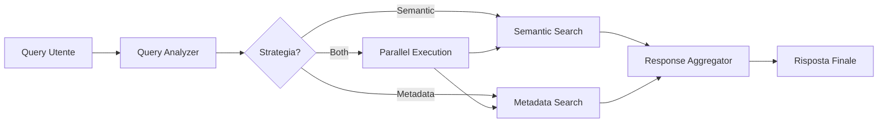

# Implementazione Sistema Chat Query Processing - Report di Lavoro

**Data:** 24 Novembre 2024  
**Progetto:** PramaIA Services  
**Focus:** Implementazione nodi per elaborazione intelligente query di chat

## Obiettivo

Implementare un sistema completo di nodi per il processing delle query di chat che permetta di elaborare richieste degli utenti sia sui metadati che sul contenuto dei documenti, utilizzando l'architettura workflow-based di PramaIA PDK.

## Lavoro Svolto

### 🔧 **Sviluppo Nodi Core**

#### 1. Chat Query Analyzer Node
- **File:** `core-rag-plugin/src/chat_query_analyzer_processor.py`
- **Funzionalità:**
  - Analisi automatica delle query utente
  - Identificazione intent semantici vs metadati
  - Classificazione tipo domanda (informational, temporal, procedural, causal)
  - Calcolo confidence scores per determinare strategia ottimale
  - Supporto per query complesse multi-criterio

#### 2. Semantic Search Node  
- **File:** `core-rag-plugin/src/semantic_search_processor.py`
- **Funzionalità:**
  - Interfaccia diretta con VectorstoreService (localhost:8090)
  - Ricerca semantica per similarità del contenuto
  - Sistema di fallback per maggiore affidabilità
  - Estrazione automatica snippet rilevanti
  - Gestione timeout e error handling

#### 3. Metadata Search Node
- **File:** `core-rag-plugin/src/metadata_search_processor.py` 
- **Funzionalità:**
  - Ricerca basata sui metadati dei documenti
  - Parsing intelligente criteri temporali (oggi, ieri, settimana, date specifiche)
  - Riconoscimento tipi file (PDF, DOC, immagini)
  - Filtri per autore, dimensione, collezione
  - Scoring multi-criterio per ranking risultati

#### 4. Response Aggregator Node
- **File:** `core-rag-plugin/src/response_aggregator_processor.py`
- **Funzionalità:**
  - Combinazione intelligente risultati semantici e metadati
  - Deduplicazione documenti duplicati
  - Scoring pesato configurabile (default: 70% semantico, 30% metadati)
  - Generazione risposte formattate user-friendly
  - Estrazione automatica fonti e snippet

### 🔌 **Configurazione Plugin**

#### Aggiornamento Plugin Definition
- **File:** `core-rag-plugin/plugin.json`
- **Modifiche:**
  - Aggiunta definizione completa 4 nuovi nodi
  - Schema di configurazione dettagliati per ogni nodo
  - Input/output typing corretto
  - Icone e colori distintivi per UI

### 🔄 **Workflow Orchestration**

#### Chat Query Analyzer Workflow
- **File:** `workflows/chat_query_analyzer_workflow.json`
- **Caratteristiche:**
  - Esecuzione condizionale parallela ottimizzata
  - Timeout management (30s totale, 25s aggregator)
  - Error handling con fallback strategy
  - Monitoring e performance tracking integrati

**Flusso di Esecuzione:**
```
Input → Query Analyzer → [Semantic Search] → Response Aggregator → Output
                      → [Metadata Search] →
```

### 📚 **Documentazione Tecnica**

#### Documentazione Completa
- **File:** `PramaIA-Docs/CHAT_QUERY_PROCESSING_NODES.md`
- **Contenuto:**
  - Descrizione dettagliata ogni nodo
  - Esempi configurazione e utilizzo
  - Scenari di test per ogni tipo di query
  - Troubleshooting guide completa
  - Esempi API per testing individuale nodi

## Architettura Implementata

### Strategia di Ricerca Intelligente

Il sistema decide automaticamente quale strategia utilizzare:

1. **Semantic Only:** Query su contenuto ("Dimmi tutto sui servizi PramaIA")
2. **Metadata Only:** Query su metadati ("Documenti creati oggi")  
3. **Hybrid:** Query combinate ("Trova PDF sui progetti creati questa settimana")

### Pattern di Elaborazione



## Caratteristiche Tecniche

### 🚀 **Performance**
- Esecuzione parallela condizionale per ottimizzare tempi di risposta
- Timeout intelligenti per evitare blocchi sistema
- Fallback automatici per resilienza

### 🎯 **Accuracy**  
- Confidence scoring per selezione strategia ottimale
- Deduplicazione intelligente risultati sovrapposti
- Ranking multi-criterio per risultati più rilevanti

### 🔧 **Configurabilità**
- Ogni nodo completamente configurabile via JSON
- Template personalizzabili per formattazione risposte
- Pesi modificabili per bilanciamento semantic/metadata

### 🛡️ **Robustezza**
- Error handling completo con fallback strategy
- Logging strutturato per debugging
- Retry automatici su failure temporanei

## Casi d'Uso Supportati

| Tipo Query | Esempio | Strategia | Risultato |
|------------|---------|-----------|-----------|
| Contenuto semantico | "Spiega i servizi AI" | Semantic | Ricerca nel testo dei documenti |
| Metadati temporali | "Documenti di oggi" | Metadata | Filtro per data creazione |  
| Metadati tipologia | "Trova PDF recenti" | Metadata | Filtro tipo file + data |
| Query ibride | "PDF AI del 2024" | Both | Semantic + metadata combinati |
| Query complesse | "Chi ha scritto docs AI ieri?" | Both | Autore + contenuto + data |

## Testing e Validazione

### Endpoint di Test Disponibili

```bash
# Test singoli nodi
POST /api/nodes/{node_id}/test

# Test workflow completo  
POST /api/workflows/chat_query_analyzer_workflow/execute

# Test specifici per ogni scenario
- Query semantiche pure
- Query metadati pure  
- Query ibride complesse
- Edge cases e error handling
```

### Metriche di Monitoring

- Tempo di esecuzione per nodo
- Confidence scores per strategia selection  
- Count risultati per tipo di ricerca
- Success/failure rates con breakdown

## Integrazione Sistema

### Compatibilità
- ✅ Integrato con VectorstoreService esistente
- ✅ Compatibile con architettura PDK workflow
- ✅ Logging integrato con PramaIA LogService
- ✅ Pronto per integrazione chat server tramite trigger system

### Prossimi Passi Consigliati
1. **Testing End-to-End:** Validazione con dati reali
2. **Performance Tuning:** Ottimizzazione timeout e batch sizes
3. **UI Integration:** Interfaccia per configurazione nodi
4. **Analytics:** Dashboard per monitoring utilizzo e performance

## Deliverable Prodotti

### File Creati/Modificati
- 4 nuovi processor Python (`*_processor.py`)
- 1 plugin configuration aggiornata (`plugin.json`)  
- 1 workflow definition completa (`chat_query_analyzer_workflow.json`)
- 1 documentazione tecnica completa (`CHAT_QUERY_PROCESSING_NODES.md`)

### Capacità Abilitate
- ✅ Processing intelligente query di chat
- ✅ Ricerca combinata semantica + metadati  
- ✅ Risposta contestuale formattata
- ✅ Scalabilità e configurabilità avanzate
- ✅ Monitoring e debugging completo

---

**Stato:** ✅ **COMPLETATO**  
**Pronto per:** Integrazione produzione e testing utente finale

*Il sistema implementato fornisce le fondamenta per un chat assistant intelligente capace di rispondere a query complesse combinando ricerca semantica e sui metadati in modo ottimale e completamente automatizzato.*